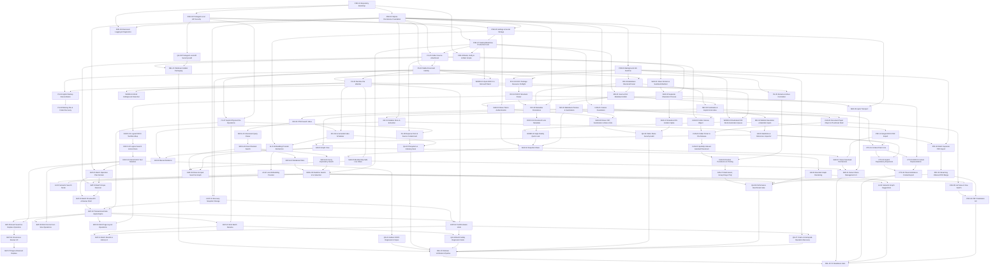

# Sprint Dependency Graph

This graph is generated from `sprint-manifest.json`.

```mermaid
flowchart TD
    FND_01["FND-01 Repository Bootstrap"]
    FND_02["FND-02 Privileged Local API Security"]
    FND_03["FND-03 SQLite Persistence Foundation"]
    FND_04["FND-04 Background Job Runtime"]
    FND_05["FND-05 Settings & Secret Storage"]
    FND_06["FND-06 Structured Logging & Diagnostics"]
    FND_07["FND-07 Desktop/WebView Production Host"]
    FND_08["FND-08 Build, Verify & Artifact Scripts"]
    FS_01["FS-01 Folder Source Attachment"]
    FS_02["FS-02 Stable Document Identity"]
    FS_03["FS-03 Runtime File Watcher"]
    FS_04["FS-04 Hybrid Startup Reconciliation"]
    FS_05["FS-05 Rename & Move Correlation"]
    FS_06["FS-06 Missing File & Folder Recovery"]
    FS_07["FS-07 Explicit Physical File Operations"]
    FS_08["FS-08 Reparse Point & Source Containment"]
    IDX_01["IDX-01 DOCX Package Resource Preflight"]
    IDX_02["IDX-02 DOCX Structural Parser"]
    IDX_03["IDX-03 Markdown Structural Parser"]
    IDX_04["IDX-04 Metadata Persistence"]
    IDX_05["IDX-05 FTS5 Search Index"]
    IDX_06["IDX-06 Incremental Index Scheduler"]
    SRCH_01["SRCH-01 Structured Query Parser"]
    SRCH_02["SRCH-02 Exact Ranked Search"]
    SRCH_03["SRCH-03 Metadata Filters"]
    SRCH_04["SRCH-04 Fuzzy Exploratory Search"]
    SRCH_05["SRCH-05 Realtime Search UI & Selection"]
    CAN_01["CAN-01 Canvas Foundation"]
    CAN_02["CAN-02 Folder Canvas Object"]
    CAN_03["CAN-03 Document Paper Object & Thumbnail Shell"]
    CAN_04["CAN-04 Folder Picker & File Release"]
    CAN_05["CAN-05 Spatially Indexed Assisted Placement"]
    CAN_06["CAN-06 Position Persistence & Pinning"]
    CAN_07["CAN-07 Multi-Select, Group Drag & Tidy"]
    CAN_08["CAN-08 List View & View Switch"]
    DOCX_01["DOCX-01 Logical DOCX Text/Run Map"]
    DOCX_02["DOCX-02 Logical Search Across Runs"]
    DOCX_03["DOCX-03 Strict DOCX Text Mutation"]
    DOCX_04["DOCX-04 Document Lens Metadata"]
    WORD_01["WORD-01 Open DOCX in Microsoft Word"]
    WORD_02["WORD-02 Word Editing/Lock Detection"]
    WORD_03["WORD-03 Dedicated STA Word Automation Queue"]
    WORD_04["WORD-04 High-Fidelity Quick Look"]
    BAT_01["BAT-01 Batch Operation Plan Domain"]
    BAT_02["BAT-02 Batch Scope Resolver"]
    BAT_03["BAT-03 Batch Preview API & Review Shell"]
    HIST_01["HIST-01 Recovery Snapshot Storage"]
    BAT_04["BAT-04 Transactional Safe Apply Engine"]
    BAT_05["BAT-05 Exact Search & Replace Operation"]
    BAT_06["BAT-06 Occurrence Review UX"]
    BAT_07["BAT-07 Regex Advanced Replace"]
    BAT_08["BAT-08 Strict Font & Font-Size Operations"]
    BAT_09["BAT-09 Strict Page-Layout Operations"]
    BAT_10["BAT-10 Strict Batch Rename"]
    HIST_02["HIST-02 Conflict-Aware Undo"]
    BAT_11["BAT-11 Batch Results & History UI"]
    MD_01["MD-01 Source-First Markdown Editor"]
    MD_02["MD-02 Markdown Preview & Sanitization"]
    MD_03["MD-03 Frontmatter & Explicit Link Index"]
    MD_04["MD-04 Wikilink Resolution & Backlink Inputs"]
    GR_01["GR-01 Relation Store & Extraction"]
    GR_02["GR-02 Backlinks & Reference Inspector"]
    GR_03["GR-03 Graph View"]
    GR_04["GR-04 Manual Relations"]
    GR_05["GR-05 Bounded Graph Rendering"]
    AI_01["AI-01 Embedding Provider Abstraction"]
    AI_02["AI-02 Local Embedding Provider"]
    AI_03["AI-03 Semantic Search Mode"]
    AI_04["AI-04 Semantic Graph Suggestions"]
    CTX_01["CTX-01 Context Pack Core"]
    CTX_02["CTX-02 Explicit Dependency Expansion"]
    CTX_03["CTX-03 DOCX Context Representation"]
    CTX_04["CTX-04 Token Estimate & Context Export"]
    PDF_01["PDF-01 Single DOCX PDF Export"]
    PDF_02["PDF-02 Batch Separate PDF Export"]
    PDF_03["PDF-03 Streaming Ordered PDF Merge"]
    PDF_04["PDF-04 PDF Finalization UX"]
    SHR_01["SHR-01 Share Domain & Sanitized Manifest"]
    SHR_02["SHR-02 Separate ShareHost Process"]
    SHR_03["SHR-03 Share Token Authentication"]
    SHR_04["SHR-04 Snapshot Share"]
    SHR_05["SHR-05 Membership-Safe Live Share"]
    SHR_06["SHR-06 Share-Scoped Search & Graph"]
    SHR_07["SHR-07 Share Download Permissions"]
    SHR_08["SHR-08 Share CSP, Sanitization & Rate Limits"]
    SHR_09["SHR-09 ngrok Transport"]
    SHR_10["SHR-10 ShareHost OS Isolation Spike"]
    SHR_11["SHR-11 Owner Share Management UI"]
    QA_01["QA-01 Golden DOCX Regression Corpus"]
    QA_02["QA-02 Filesystem & Indexing Soak"]
    QA_03["QA-03 Privileged Local API Security Audit"]
    QA_04["QA-04 Batch Safety Regression Suite"]
    QA_05["QA-05 Public Share Security Audit"]
    QA_06["QA-06 Performance Benchmark Gate"]
    QA_07["QA-07 Crash & Interrupted-Operation Recovery"]
    REL_01["REL-01 Windows Installer Packaging"]
    REL_02["REL-02 Release Verification Pipeline"]
    REL_03["REL-03 V1 Readiness Gate"]
    FND_01 --> FND_02
    FND_01 --> FND_03
    FND_03 --> FND_04
    FND_02 --> FND_05
    FND_03 --> FND_05
    FND_01 --> FND_06
    FND_03 --> FND_06
    FND_02 --> FND_07
    FND_05 --> FND_07
    FND_01 --> FND_08
    FND_07 --> FND_08
    FND_03 --> FS_01
    FND_07 --> FS_01
    FND_03 --> FS_02
    FS_01 --> FS_02
    FND_04 --> FS_03
    FS_02 --> FS_03
    FS_02 --> FS_04
    FS_03 --> FS_04
    FS_02 --> FS_05
    FS_03 --> FS_05
    FS_04 --> FS_06
    FS_02 --> FS_07
    FND_02 --> FS_07
    FS_01 --> FS_08
    FS_07 --> FS_08
    FND_04 --> IDX_01
    FS_02 --> IDX_01
    IDX_01 --> IDX_02
    FND_04 --> IDX_03
    FS_02 --> IDX_03
    IDX_02 --> IDX_04
    IDX_03 --> IDX_04
    FND_03 --> IDX_04
    IDX_04 --> IDX_05
    IDX_05 --> IDX_06
    FS_03 --> IDX_06
    IDX_05 --> SRCH_01
    SRCH_01 --> SRCH_02
    SRCH_02 --> SRCH_03
    SRCH_02 --> SRCH_04
    SRCH_03 --> SRCH_05
    SRCH_04 --> SRCH_05
    FND_07 --> SRCH_05
    FND_07 --> CAN_01
    FND_03 --> CAN_01
    FS_01 --> CAN_02
    CAN_01 --> CAN_02
    IDX_04 --> CAN_03
    CAN_01 --> CAN_03
    CAN_02 --> CAN_04
    CAN_03 --> CAN_04
    CAN_04 --> CAN_05
    CAN_05 --> CAN_06
    FS_05 --> CAN_06
    CAN_06 --> CAN_07
    CAN_03 --> CAN_08
    SRCH_05 --> CAN_08
    IDX_02 --> DOCX_01
    DOCX_01 --> DOCX_02
    DOCX_02 --> DOCX_03
    IDX_04 --> DOCX_04
    FND_07 --> WORD_01
    FS_02 --> WORD_01
    WORD_01 --> WORD_02
    FS_03 --> WORD_02
    FND_04 --> WORD_03
    WORD_01 --> WORD_03
    WORD_03 --> WORD_04
    DOCX_04 --> WORD_04
    FND_03 --> BAT_01
    DOCX_03 --> BAT_01
    FS_01 --> BAT_02
    SRCH_05 --> BAT_02
    BAT_01 --> BAT_02
    BAT_01 --> BAT_03
    BAT_02 --> BAT_03
    FND_03 --> HIST_01
    FS_02 --> HIST_01
    BAT_03 --> BAT_04
    HIST_01 --> BAT_04
    FS_07 --> BAT_04
    BAT_04 --> BAT_05
    DOCX_03 --> BAT_05
    BAT_05 --> BAT_06
    BAT_06 --> BAT_07
    BAT_04 --> BAT_08
    DOCX_03 --> BAT_08
    BAT_04 --> BAT_09
    DOCX_03 --> BAT_09
    BAT_04 --> BAT_10
    FS_07 --> BAT_10
    HIST_01 --> HIST_02
    BAT_04 --> HIST_02
    FS_03 --> HIST_02
    BAT_10 --> BAT_11
    HIST_02 --> BAT_11
    FND_07 --> MD_01
    IDX_03 --> MD_01
    MD_01 --> MD_02
    IDX_03 --> MD_03
    MD_01 --> MD_03
    MD_03 --> MD_04
    MD_03 --> GR_01
    FND_03 --> GR_01
    GR_01 --> GR_02
    MD_04 --> GR_02
    GR_02 --> GR_03
    CAN_01 --> GR_03
    GR_01 --> GR_04
    GR_03 --> GR_04
    GR_03 --> GR_05
    FND_05 --> AI_01
    IDX_06 --> AI_01
    AI_01 --> AI_02
    AI_02 --> AI_03
    SRCH_05 --> AI_03
    AI_02 --> AI_04
    GR_05 --> AI_04
    MD_03 --> CTX_01
    GR_02 --> CTX_01
    CTX_01 --> CTX_02
    GR_02 --> CTX_02
    CTX_01 --> CTX_03
    IDX_02 --> CTX_03
    CTX_02 --> CTX_04
    CTX_03 --> CTX_04
    WORD_03 --> PDF_01
    PDF_01 --> PDF_02
    FND_04 --> PDF_02
    PDF_02 --> PDF_03
    CAN_08 --> PDF_04
    PDF_03 --> PDF_04
    FND_03 --> SHR_01
    SHR_01 --> SHR_02
    FND_08 --> SHR_02
    SHR_02 --> SHR_03
    FND_05 --> SHR_03
    SHR_03 --> SHR_04
    WORD_04 --> SHR_04
    MD_02 --> SHR_04
    SHR_04 --> SHR_05
    FS_03 --> SHR_05
    SHR_05 --> SHR_06
    SRCH_02 --> SHR_06
    GR_03 --> SHR_06
    SHR_04 --> SHR_07
    PDF_01 --> SHR_07
    SHR_03 --> SHR_08
    MD_02 --> SHR_08
    SHR_02 --> SHR_09
    FND_05 --> SHR_09
    SHR_02 --> SHR_10
    SHR_05 --> SHR_11
    SHR_07 --> SHR_11
    SHR_09 --> SHR_11
    DOCX_03 --> QA_01
    FS_08 --> QA_02
    IDX_06 --> QA_02
    FND_02 --> QA_03
    BAT_10 --> QA_04
    HIST_02 --> QA_04
    SHR_08 --> QA_05
    SHR_10 --> QA_05
    CAN_07 --> QA_06
    SRCH_05 --> QA_06
    GR_05 --> QA_06
    PDF_03 --> QA_06
    FND_04 --> QA_07
    HIST_02 --> QA_07
    FND_08 --> REL_01
    QA_03 --> REL_01
    REL_01 --> REL_02
    QA_01 --> REL_02
    QA_02 --> REL_02
    QA_04 --> REL_02
    QA_05 --> REL_02
    QA_06 --> REL_02
    QA_07 --> REL_02
    REL_02 --> REL_03
    SHR_11 --> REL_03
    CTX_04 --> REL_03
    AI_04 --> REL_03
    PDF_04 --> REL_03
```

For execution, use `SPRINT-STATUS.md`; the graph is orientation/reference, not the status source of truth.
